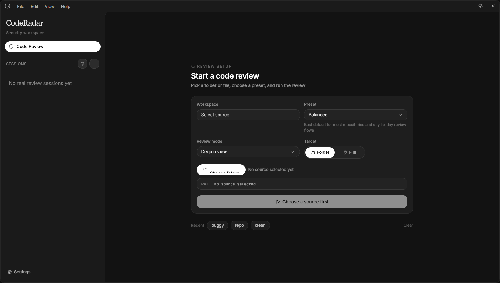
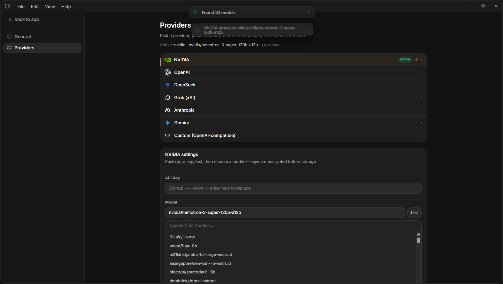
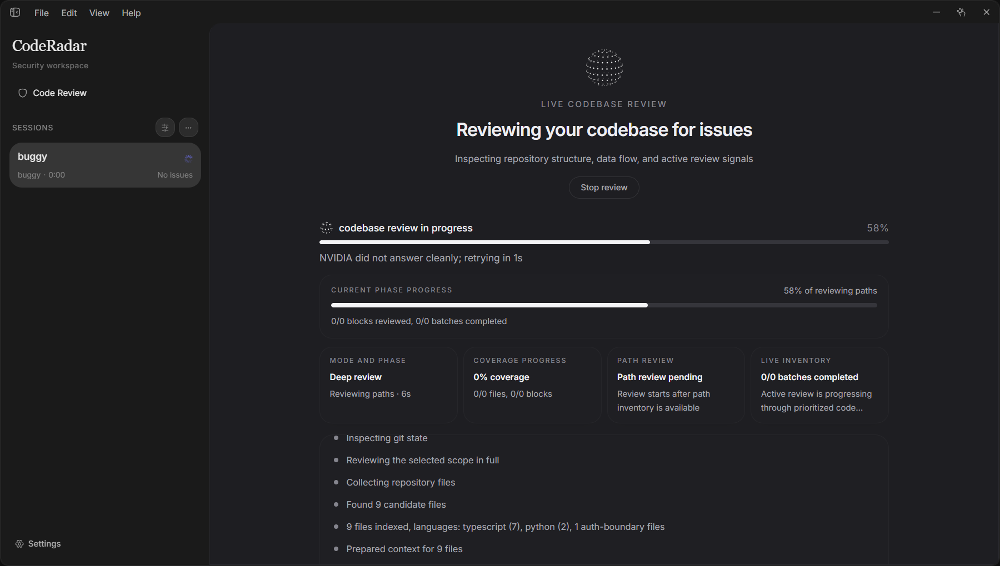
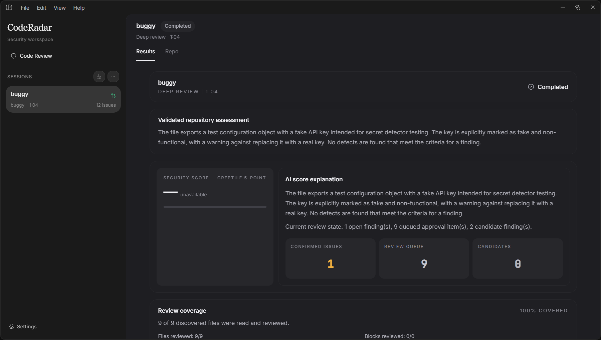
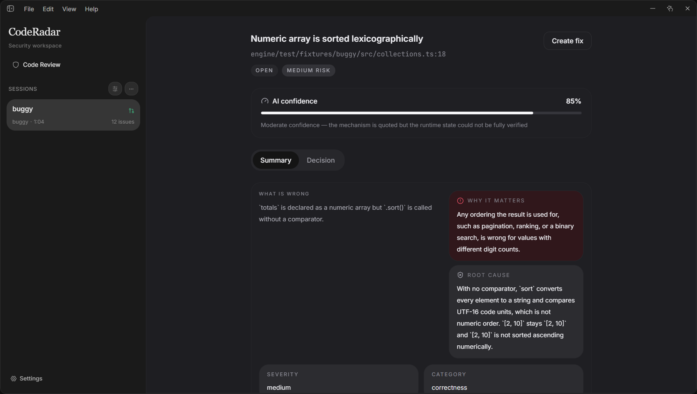

# CodeRadar

CodeRadar is a local-first code review desktop app. You point it at a file or a folder, it reads the
code, and it reports the defects it can prove — each with the quoted evidence it came from, the
consequence if it ships, and a concrete fix.

Everything runs on your machine. There is one runtime: **Electron + Node.js + TypeScript**. No Python
and no Rust are required, installed, or invoked at runtime.

## What it looks like

These are screenshots of the running app, not mock-ups. They were taken by
`frontend/scripts/screenshots.mjs`, which drives the same Electron window a user drives and runs a
real review of `engine/test/fixtures/buggy` through a real model provider.

**Pick a source, choose a preset, run the review.**



**Connect a provider.** The key is tested with a live call before it is saved, and it is listed back
masked once active.



**The review runs in the app.** Progress streams as the engine walks the repository.



**Findings, and what the bar dropped.** The results screen separates validated findings from the
candidates the review bar refused, so a dropped claim stays visible as a count instead of silently
disappearing.



**Open a finding.** Each one carries its severity, the confidence behind it, and the fix it proposes.



To regenerate the set, start the dev server and point the script at your own provider:

```bash
cd frontend
bun run dev &
CODERADAR_AI_KEY=... node scripts/screenshots.mjs
```

The script replaces the whole set on every run and asserts the marker each screen is known by, so a
capture cannot go stale silently: when the progress screen or the findings list is not on screen, it
says the capture was skipped instead of writing a picture of the wrong thing.

## Architecture

```
CodeRadar
│
├── Electron
│   ├── Main process ──────────────────────────────┐
│   └── React renderer                             │
│                                                  ▼
│                                        TypeScript review engine
│                                        ├── Repository discovery
│                                        ├── Git (branch, diff, changed lines)
│                                        ├── Repository index (languages, manifests, hotspots)
│                                        ├── Context (imports and export surfaces)
│                                        ├── Deterministic detectors
│                                        ├── AI review (OpenAI-compatible providers)
│                                        ├── Validation (evidence must be in the source)
│                                        ├── Dedupe and the confidence bar
│                                        └── Findings
│                                                  │
│                                        local API on 127.0.0.1
│                                                  │
└──────────────────────────────────────────────────┘
```

The engine core (`engine/src/core/`) imports no `node:fs`, no `node:path`, and never shells out. It
depends on two ports — a filesystem and a git adapter — which is why the whole pipeline is testable
against fixtures, and why the same code serves the desktop app and the CLI.

Two things are load-bearing and enforced by the engine, not by convention:

- **Nothing reaches a report without passing validation.** A finding must quote code that is actually
  in the file it names, at a line that is actually in range. There is no bypass for detectors, for the
  model, or for a future adapter.
- **A failed model call is not a failed review.** An unavailable provider degrades the run to the
  deterministic checks and says so on the progress stream.

## Repository layout

```
engine/                    the review engine (TypeScript, no runtime dependencies)
  src/core/                pipeline: language detection, discovery, index, diff, context, findings
  src/adapters/            node filesystem and git
  src/node/                settings, providers, the review service, the local API
  src/cli.ts               `bun run review <path>`
  src/eval/                scores a saved run against a fixture's ground truth
  scripts/score-review.ts  `bun run score <run.json>`
  prompts/                 the review policy and reviewer persona, as markdown (canonical)
  test/                    fixtures with planted defects, and the suite that pins them
frontend/                  Electron + React desktop app
  electron/main.cjs        starts the engine in-process and opens the window
  electron/review-engine.cjs  the engine, bundled from engine/src/node/electron-entry.ts
  electron/prompts/        generated copy of engine/prompts, written by the build
  src/                     React renderer
docs/                      design notes and the migration record
```

## Getting started

Prerequisites: **Bun** and **git**. Nothing else — the same toolchain runs the engine,
its tests, and the bundle the desktop app loads.

```bash
cd frontend && bun install
cd ../engine && bun install
```

### Running it

The review engine and the app are separate processes, and there are two ways to start
them. Both give you the same app.

**One command, engine in its own process** (the normal development flow):

```bash
cd frontend
bun run dev:all
```

This starts the engine on its own, waits for it to answer, then starts Vite and
Electron and tells the app where the engine is. The engine's URL and token are printed at
startup, so you can `curl` it while the app runs:

```
CodeRadar: engine ready at http://127.0.0.1:54321/api/v1
CodeRadar: token 9f2c... (send it as the x-coderadar-token header)
```

**App only, engine embedded** (nothing else to run; Electron starts the engine itself):

```bash
cd frontend
bun run electron:dev
```

Use `dev:all` when you are working on the engine: you can restart it alone, hit its routes
directly, and watch it fail without losing the UI. Use `electron:dev` when you only care
about the app, or to check the packaged behaviour, where the engine is embedded because a
desktop app cannot ask the user to start a server first.

### The engine on its own

The engine is a complete backend on its own, with no Electron involved:

```bash
cd engine
bun run serve                 # local API on 127.0.0.1:9000, prints its token and a curl example
```

And a one-shot review from the command line, which needs no server at all:

```bash
cd engine
bun run review ../frontend/src --json
bun run review . --changed-only --base main --fail-on high
```

### Building

```bash
cd frontend && bun run electron:build:win   # installer
```

The engine is bundled into `frontend/electron/review-engine.cjs` before the app is built or
developed, because that file is what the Electron main process loads. `electron:dev`,
`electron:build`, and `electron:build:win` all run this step first, so none of them can start the
app against a bundle older than `engine/src`:

```bash
cd frontend && bun run engine:bundle   # also copies engine/prompts into electron/prompts
```

Both generated paths are ignored by git. They are regenerated from `engine/src` and
`engine/prompts`, which are the sources of truth.

### Review from the command line

The engine is useful without the desktop app:

```bash
cd engine
bun run review ../frontend/src --json
bun run review . --changed-only --base main --fail-on high
```

AI is opt-in from the environment; without all three variables the review runs the deterministic
detectors only:

```
CODE_RADAR_AI_ENDPOINT   Full chat-completions URL
CODE_RADAR_AI_KEY        Provider API key
CODE_RADAR_AI_MODEL      Model name
```

## Configuration

| Variable | Default | Meaning |
|---|---|---|
| `CODE_RADAR_API_PORT` | `9000` when served alone, ephemeral inside the app | Port for the local review API. The app tells the renderer where it landed, so this is only needed to pin a port. |
| `CODE_RADAR_API_TOKEN` | generated per start | Secret every data route requires. Printed by `bun run serve`. |
| `CODE_RADAR_SETTINGS_DIR` | the OS user-data directory | Where `settings.json` and the standalone local key live. |
| `CODE_RADAR_API_BASE_URL` | unset | Set on the **app** to make it connect to an already-running engine instead of starting its own. This is what `dev:all` sets. |

Provider, model, API key, and review defaults are stored as JSON in the app's user-data directory and
edited through the app's Settings screen. The API key is encrypted with the OS keychain
(`safeStorage`); on a machine with no key store the app refuses to save one rather than writing it in
clear.

## Testing

```bash
cd engine   && bun run typecheck && bun test    # 197 tests
cd frontend && bun run test                     # 72 tests
```

The engine suite covers the pipeline, the repository index, the settings store, and the local API
contract end-to-end — including the security envelope, which is tested against real requests. The
finding validator is pinned by regression tests taken from real model output, including the three
ways a model can write a true claim differently from the file (a quote character, a dash, and the
statement terminator at the end of an excerpt) and the controls that must stay rejected.

`engine/test/fixtures/ai-review` is the accuracy fixture: a small repository with planted defects
(`D1`-`D9`) and code written to look wrong but correct (`C1`-`C10`), both recorded in
`GROUND_TRUTH.md`. `bun run score <run.json>` scores any saved run against those tables, so a run
says not only how many findings it kept but which defects it surfaced and which claims nothing
supports. The GUI smoke test scores a live run with the same scorer.

## Security model

The local API is the only part of the app that listens on a socket, and it can read the user's source
tree and send it to a model provider. Four controls, each closing a specific hole:

1. It binds to `127.0.0.1` only.
2. Every data route requires a **per-launch token** that the main process generates and never writes
   to disk. A web page in the user's browser cannot read it.
3. The `Origin` header is checked against the app's own origins, and `Access-Control-Allow-Origin` is
   never a wildcard, so no other page can read a response.
4. The `Host` header must be loopback, which refuses DNS-rebinding requests.

Provider base URLs are validated before use: `https` unless the host is loopback, no embedded
credentials, and no private or link-local addresses.

## License

[Specify your license here]
